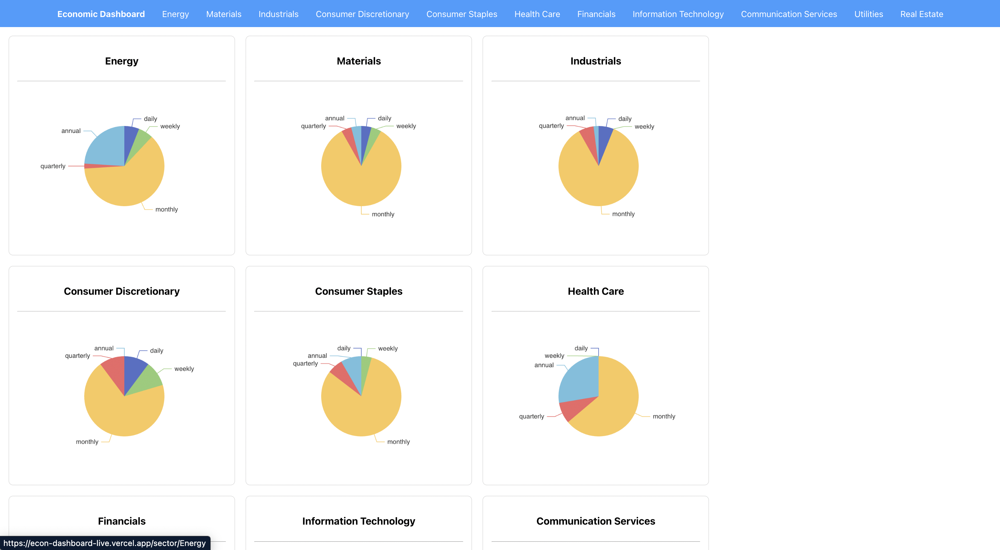

# 📊 Economic Data Dashboard

This project provides an interactive economic data dashboard designed to visualize, compare, and analyze macroeconomic indicators across GICS sectors. It leverages data from the Federal Reserve Economic Data (FRED) API and includes a curated mix of daily, weekly, monthly, quarterly, and annual series—including price indices, production metrics, employment statistics, and sector-specific financial indicators. The dashboard supports U.S. and select global data (e.g., China, Europe) and aims to offer a flexible platform for macroeconomic analysis, forecasting, and investment research.


You can find the project preview [here](https://econ-dashboard-live.vercel.app)

---

## 🧰 Tech Stack

### 🔙 Backend
- Python 3.12
- FastAPI – REST API framework
- fredapi – FRED data access
- uvicorn – ASGI server

### 🌐 Frontend
- JavaScript
- React
- Apache ECharts – Graphing and data visualization
- HTML5 & CSS3 – Styling and layout
  
---

## 📁 Project Structure

```
econ-data-dashboard/
├── app/
│   ├── backend/
│   │   ├── init.py
│   │   ├── fred_data.py
│   │   ├── gics_mapping.py
│   │   └── routes/
│   │       ├── init.py
│   │       ├── data.py
│   │       ├── main.py
│   │       └── sectors.py
│   └── frontend/
│       ├── node_modules/
│       ├── public/
│       │   ├── index.html
│       │   └── favicon.ico
│       ├── src/
│       │   ├── App.js
│       │   ├── index.js
│       │   ├── index.css
│       │   ├── components/
│       │   │   ├── MainGraph.jsx
│       │   │   ├── NavBar.jsx
│       │   │   ├── SectorSummary.jsx
│       │   │   └── SeriesSnapshot.jsx
│       │   └── pages/
│       │       ├── LandingPage.jsx
│       │       ├── SectorPage.jsx
│       │       └── SeriesPage.jsx
│       ├── package.json
│       ├── package-lock.json
│       └── README.md
├── LICENSE
├── README.md
├── requirements.txt
└── .gitignore
```

---

## 🚀 Getting Started

### 1. Clone the Repository
```bash
git clone https://github.com/YOUR_USERNAME/econ-data-dashboard.git
cd econ-data-dashboard
```

### 2. Set Up Your Python Environment
```bash
python -m venv venv
source venv/bin/activate        # On Windows: venv\Scripts\activate
```

### 3. Install Dependencies
```bash
pip install -r requirements.txt
```

### 4. Configure Your Environment

Create a `.env` file in the root directory:

```bash
touch .env
```

Then add your FRED API key like this:
```env
FRED_API_KEY=your_fred_api_key_here
```

> You can request a free FRED API key from https://fred.stlouisfed.org

---

## 🧪 Running the App

### Run the FastAPI Backend
```bash
uvicorn app.backend.routes.main:app --reload
```

### Access API Docs
After starting the server, go to:
```
http://localhost:8000/docs
```
This is the interactive Swagger UI where you can test API routes.

---

## 🌐 Running the Frontend

The frontend is built using React and Apache ECharts, located in the `app/frontend` directory.

### 1. Navigate to the frontend directory
```bash
cd app/frontend
```

### 2. Install dependencies
Make sure you have Node.js and npm installed: https://nodejs.org/
```bash
npm install
```

### 3. Start the React development server
```bash
npm start
```

By default, this will open your app in the browser at:
```
http://localhost:3000
```

The React app will automatically reload when you make changes to the source code.

Make sure your FastAPI backend is running (on `http://localhost:8000`) so the frontend can access the API endpoints without issues.

---

## 🧾 License

This project is licensed under the [MIT License](LICENSE).

---

## 🙋‍♂️ Maintainer

Parker Hayashi  
[GitHub: @parkerhayashi](https://github.com/parkerhayashi)
